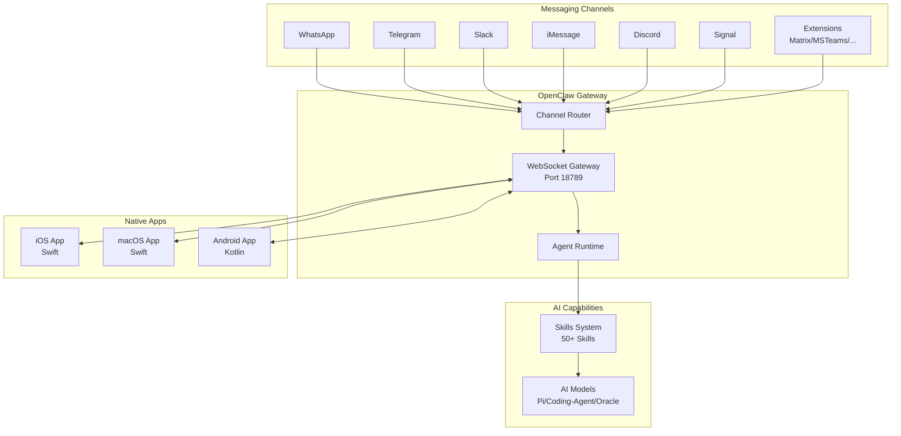
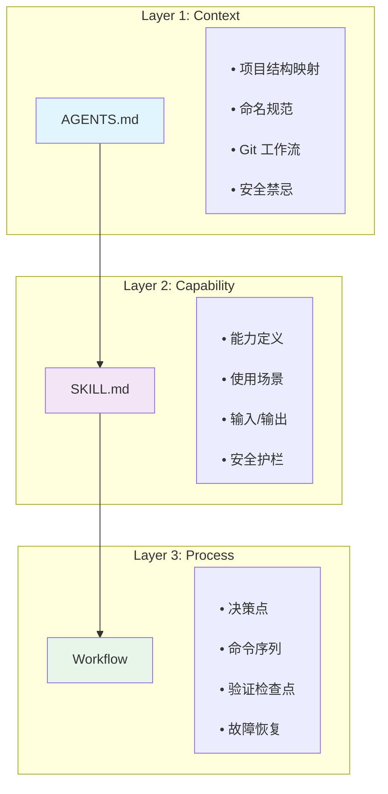
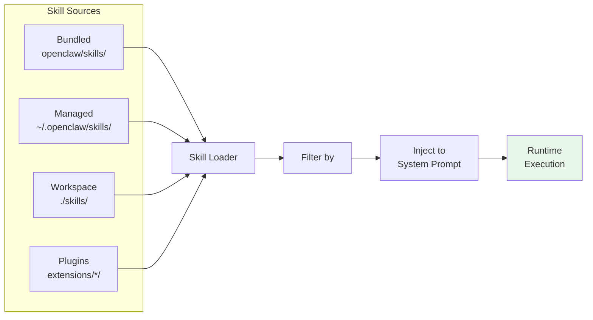
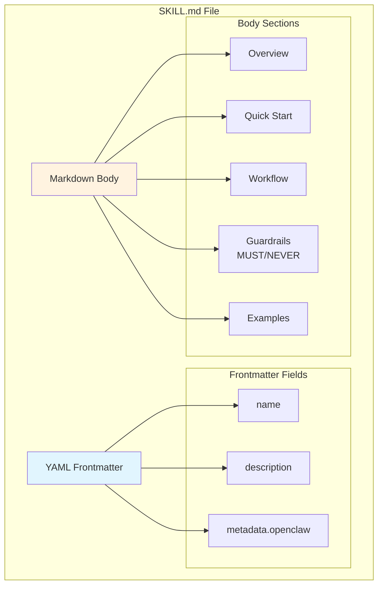
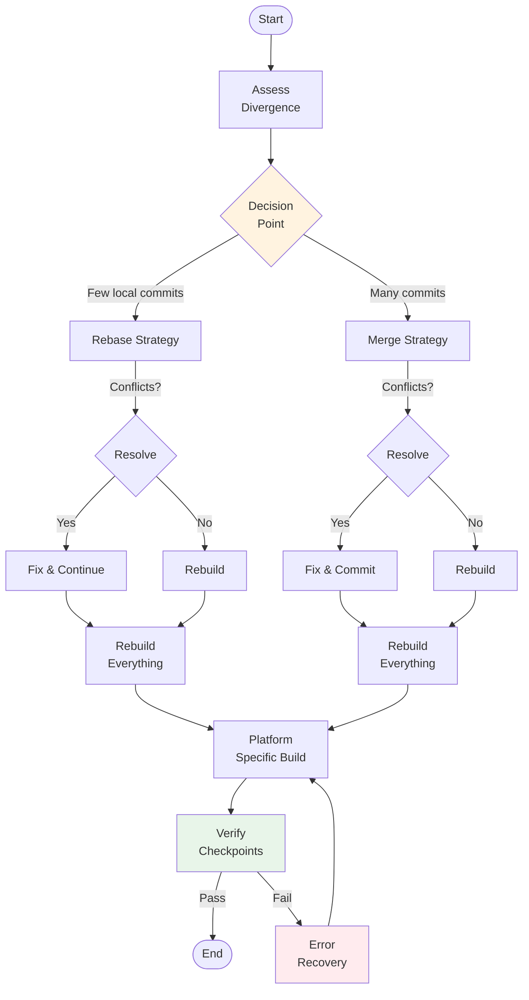
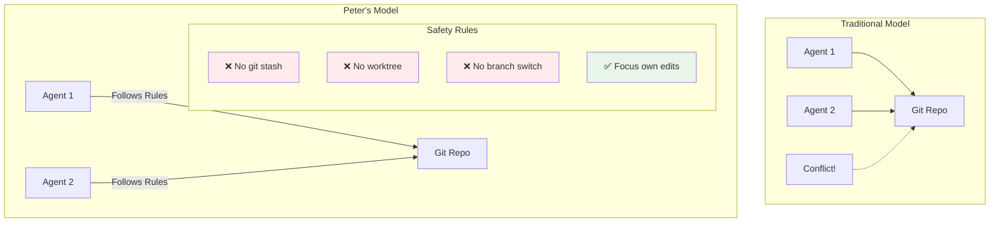

# OpenClaw (ClawdBot) 拆解报告

> **阅读建议**：先看图表理解架构，再读文字深入细节。

---

## 一、系统架构图



**核心洞察**：所有消息渠道通过 **WebSocket 网关** 统一接入，而非分散的 webhook。这是架构上的关键决策。

---

## 二、Peter 的 Vibe-coding 三层模型



**核心洞察**：不是让 AI 猜测，而是**分层提供上下文** → **声明能力** → **固化流程**。

---

## 三、Skills 系统架构



### Skill 加载优先级

```
bundled → managed → workspace → extraDirs
(内置)    (用户级)   (项目级)    (额外目录)
```

---

## 四、SKILL.md 结构解析



**示例**：`skills/github/SKILL.md`

```yaml
---
name: github
description: GitHub operations via CLI
metadata:
  openclaw:
    install:
      brew: ["gh"]
    requires: ["gh"]
---

## Overview
Operate GitHub via the gh CLI...

## Guardrails
- MUST: Use `gh pr view` before commenting
- NEVER: Edit workflow files directly
```

---

## 五、AI 工作流设计模式



**核心洞察**：每个工作流都有**决策门** + **验证检查点** + **故障恢复路径**。

---

## 六、多 Agent 安全模型



**核心洞察**：Peter 明确预设"多 Agent 同时工作"的场景，用规则避免冲突。这是大多数 AI 项目忽略的问题。

---

## 七、项目目录结构

```
openclaw/
├── src/
│   ├── gateway/          # WebSocket 网关（核心）
│   ├── channels/         # 消息渠道抽象
│   ├── agents/           # AI Agent 运行时
│   ├── cli/              # CLI 命令
│   └── [domain]/         # 领域分组
├── apps/
│   ├── ios/              # Swift iOS
│   ├── macos/            # Swift macOS
│   └── android/          # Kotlin Android
├── extensions/           # 插件（voice-call, msteams, matrix）
├── skills/               # 50+ 个内置技能
│   ├── github/SKILL.md
│   ├── slack/SKILL.md
│   └── ...
├── .agent/workflows/     # AI 工作流定义
└── AGENTS.md             # AI 运行手册（核心）
```

---

## 八、关键方法论总结

### 8.1 范式对比

```
传统开发:    人写代码 → 人写文档 → AI 辅助
Vibe-coding: 人写规范 → AI 写代码 → 人审验收
```

### 8.2 Peter 的核心原则

| 原则 | 实践 | 效果 |
|------|------|------|
| **预设多 Agent** | 禁止 stash/分支切换 | 避免协作冲突 |
| **上下文前置** | AGENTS.md 提供完整认知 | AI 不猜测 |
| **能力声明化** | SKILL.md 定义边界 | AI 知道能做什么 |
| **流程可执行** | Workflow 是命令序列 | 不只是文档 |
| **约定优于配置** | 目录/命名/流程约定化 | 降低决策成本 |

### 8.3 可立即借鉴的实践

1. **添加 AGENTS.md** —— 定义项目结构、规范、禁忌
2. **创建 SKILL.md** —— 用 YAML + Markdown 定义 AI 能力
3. **编写 Workflow** —— 为重复流程创建可执行手册
4. **设置安全规则** —— 明确禁止危险操作

---

## 九、核心文件速查

| 文件 | 用途 | 学习重点 |
|------|------|----------|
| `AGENTS.md` | AI 员工手册 | 多 Agent 安全规则 |
| `.agent/workflows/update_clawdbot.md` | 上游同步工作流 | 决策门 + 验证检查点模式 |
| `skills/github/SKILL.md` | 典型 Skill | YAML frontmatter 结构 |
| `skills/coding-agent/SKILL.md` | 复杂 Skill | Guardrails 写法 |

---

*拆解完成。图表优先，文字补充。*
