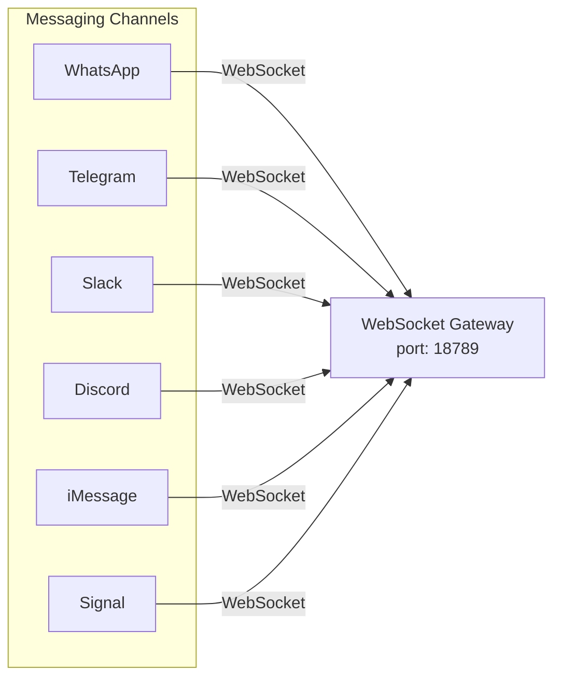
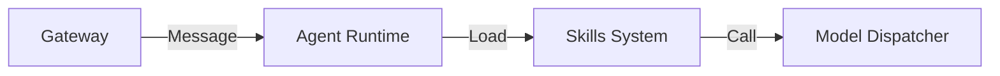
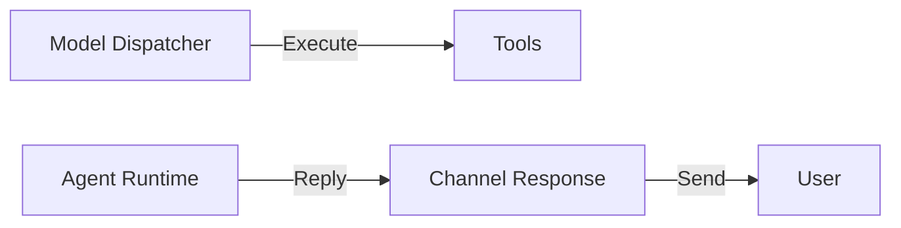
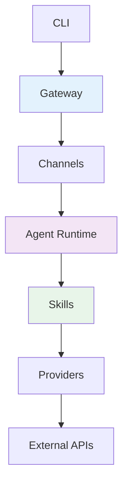
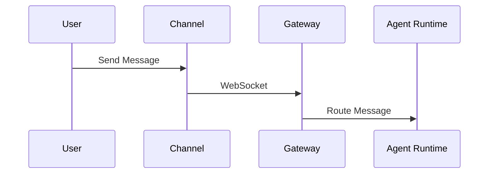
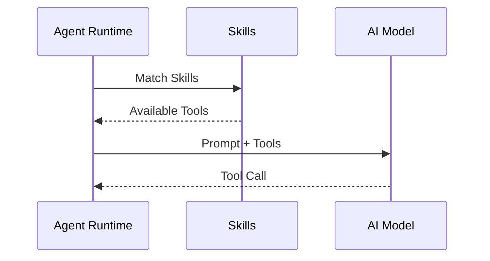
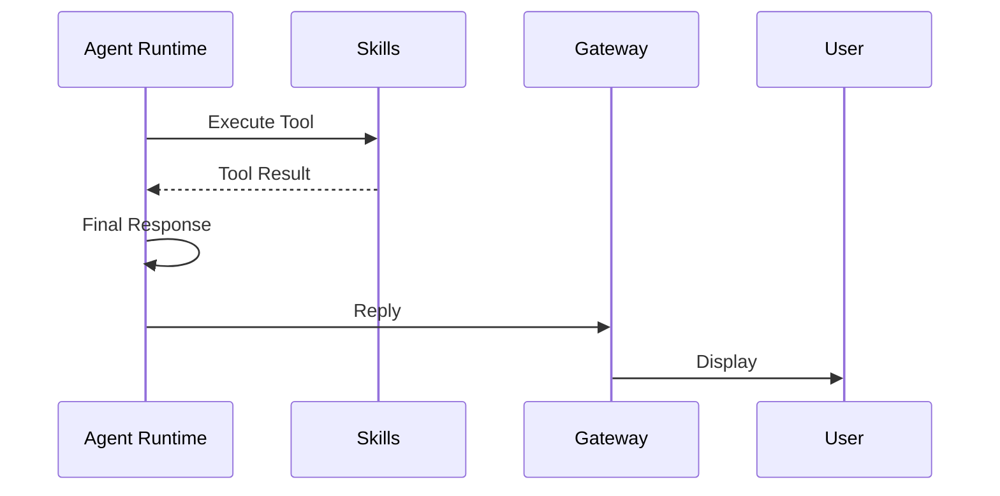

# OpenClaw 架构拆解 - L1 主脉络

> **阅读建议**：先看图，再读表，最后看文字。

---

## 一句话总结

OpenClaw 是**多平台消息网关 + AI Agent 运行时**：所有渠道（WhatsApp/Telegram/Slack 等）通过 **WebSocket Gateway（端口 18789）** 统一接入 → Gateway 路由消息 → Agent Runtime 加载 Skills → 调用工具执行。

---

## 系统分层架构

### 图 1：输入层（多渠道接入）



### 图 2：核心处理层



### 图 3：输出层



---

## 核心模块概览

| 模块 | 路径 | 职责 | 关键文件 |
|:---|:---|:---|:---|
| **Gateway** | `src/gateway/` | WebSocket 服务端，统一接入所有渠道 | `server.ts`, `methods.ts` |
| **Channels** | `src/channels/` | 渠道抽象层，协议转换 | `registry.ts`, `routing/` |
| **Agents** | `src/agents/` | AI Agent 运行时，对话管理 | `runtime.ts`, `session.ts` |
| **Skills** | `src/agents/skills/` | 技能加载、过滤、注入 | `loader.ts`, `registry.ts` |
| **Providers** | `src/providers/` | AI 模型调度（OpenAI/Anthropic/本地） | `dispatcher.ts` |
| **CLI** | `src/cli/` | 命令行接口 | `index.ts`, `commands/` |

---

## 模块依赖关系



---

## 关键设计决策

| 决策 | 选择 | 原因 |
|:---|:---|:---|
| **接入方式** | WebSocket Gateway（端口 18789） | 统一协议，避免各渠道 webhook 分散管理 |
| **渠道抽象** | Channel Registry 模式 | 新增渠道只需实现统一接口 |
| **AI 能力** | Skills 系统（声明式） | SKILL.md 定义能力，无需改代码扩展 |
| **模型调度** | Provider Dispatcher | 支持多模型 fallback（OpenAI → Anthropic → 本地） |
| **多平台** | Native Apps（Swift/Kotlin） | 网关 + 原生客户端，非纯 Web 方案 |

---

## 数据流转（简化版）

### 图 4：请求流向



### 图 5：处理流向



### 图 6：响应流向



---

## 目录结构速查

```
openclaw/
├── src/
│   ├── gateway/          # WebSocket 服务端（核心入口）
│   ├── channels/         # 渠道抽象（WhatsApp/Telegram/Slack...）
│   ├── agents/           # AI Agent 运行时
│   │   ├── skills/       # Skills 系统
│   │   ├── runtime.ts    # Agent 运行时核心
│   │   └── session.ts    # 会话管理
│   ├── providers/        # AI 模型调度
│   ├── cli/              # CLI 命令
│   └── infra/            # 基础设施（存储、网络、权限）
├── apps/
│   ├── ios/              # Swift iOS App
│   ├── macos/            # Swift macOS App
│   └── android/          # Kotlin Android App
├── extensions/           # 插件（Matrix/MSTeams/VoiceCall）
├── skills/               # 内置 Skills（50+ 个）
└── .agent/workflows/     # AI 工作流定义
```

---

## 后续拆解计划

| 文档 | 内容 | 聚焦 |
|:---|:---|:---|
| **L2-1 Gateway & Channels** | WebSocket 服务端、渠道抽象、消息路由 | `src/gateway/` `src/channels/` |
| **L2-2 Agent Runtime** | 对话管理、会话状态、上下文处理 | `src/agents/` |
| **L2-3 Skills System** | Skill 加载、过滤、注入系统 | `src/agents/skills/` |
| **L2-4 Providers** | 模型调度、多模型 fallback | `src/providers/` |
| **L3 细节实现** | 关键函数、行号、可修改点 | 精确到代码 |

---

*L1 主脉络完成。下一步：L2-1 Gateway & Channels 拆解。*
