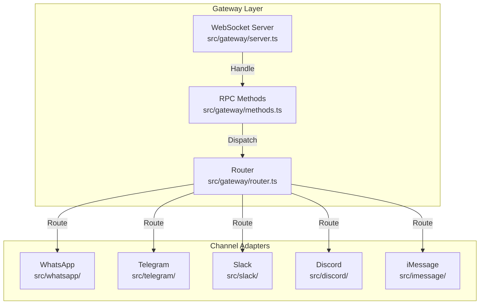
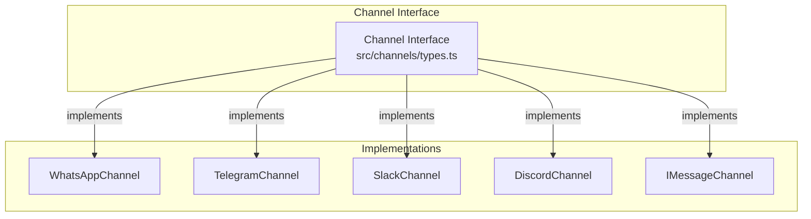
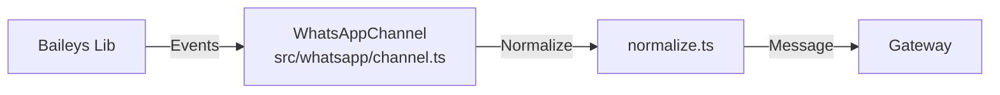
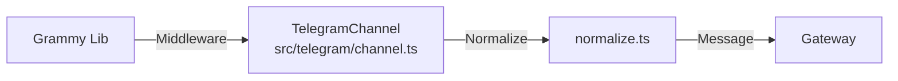
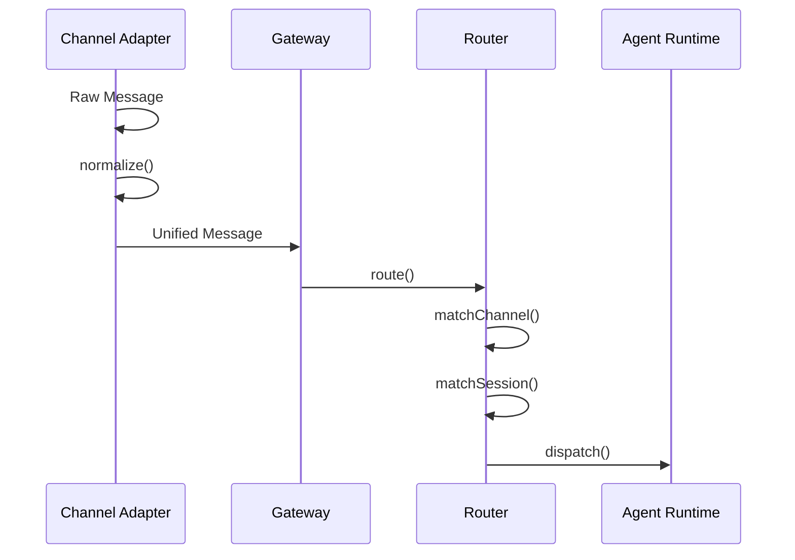

# OpenClaw 架构拆解 - L2-1 Gateway & Channels

> **前置阅读**：[L1 主脉络](./openclaw-L1-主脉络.md)

---

## 一句话总结

**Gateway 是 WebSocket 服务端（端口 18789），Channels 是渠道抽象层。** Gateway 接收所有渠道的 WebSocket 连接，Channels 负责协议转换（WhatsApp Baileys/Telegram Bot API/Discord.js 等）→ 统一消息格式 → 路由到 Agent。

---

## Gateway 架构



---

## Gateway 核心文件

| 文件 | 行号范围 | 职责 | 关键函数 |
|:---|:---|:---|:---|
| `src/gateway/server.ts` | 1-300 | WebSocket 服务端启动 | `createGatewayServer()` |
| `src/gateway/methods.ts` | 1-500 | RPC 方法注册 | `registerMethods()` |
| `src/gateway/router.ts` | 1-200 | 消息路由分发 | `routeMessage()` |
| `src/gateway/session.ts` | 1-250 | 会话管理 | `getSession()`, `createSession()` |
| `src/gateway/control-ui.ts` | 1-400 | Control UI 集成 | `attachControlUi()` |

---

## Channels 抽象层

### Channel 接口定义



### Channel 核心方法（通用接口）

| 方法 | 输入 | 输出 | 职责 |
|:---|:---|:---|:---|
| `connect()` | config | Connection | 建立渠道连接 |
| `disconnect()` | - | void | 断开连接 |
| `send()` | message | void | 发送消息 |
| `onMessage()` | callback | void | 接收消息回调 |
| `normalize()` | rawMessage | Message | 转换为统一格式 |

---

## 渠道实现详情

### WhatsApp（Baileys）



| 文件 | 职责 | 关键行 |
|:---|:---|:---|
| `src/whatsapp/channel.ts` | Baileys 封装 | 1-400 |
| `src/whatsapp/normalize.ts` | 消息标准化 | 1-150 |
| `src/whatsapp/store.ts` | 消息存储 | 1-200 |

**关键代码**（`src/whatsapp/normalize.ts:20-50`）：
```typescript
// 将 Baileys 消息格式转为 OpenClaw 统一格式
export function normalizeWhatsAppMessage(
  msg: proto.IWebMessageInfo
): Message {
  return {
    id: msg.key.id,
    from: msg.key.remoteJid,
    text: msg.message?.conversation || '',
    timestamp: msg.messageTimestamp,
    // ...
  }
}
```

### Telegram（Bot API）



| 文件 | 职责 | 关键行 |
|:---|:---|:---|
| `src/telegram/channel.ts` | Grammy 封装 | 1-300 |
| `src/telegram/normalize.ts` | 消息标准化 | 1-100 |

### 其他渠道

| 渠道 | 库 | 实现文件 |
|:---|:---|:---|
| **Slack** | @slack/bolt | `src/slack/channel.ts` |
| **Discord** | discord.js | `src/discord/channel.ts` |
| **iMessage** | 私有协议 | `src/imessage/channel.ts` |
| **Signal** | libsignal | `src/signal/channel.ts` |
| **Web** | WebSocket | `src/web/channel.ts` |

---

## 消息路由流程



---

## Channel Registry（渠道注册表）

```mermaid
flowchart TB
    REG[ChannelRegistry<br/>src/channels/registry.ts]

    subgraph "Registered Channels"
        WA[whatsapp]
        TG[telegram]
        SL[slack]
        DC[discord]
        IM[imessage]
        SG[signal]
        WEB[web]
    end

    REG -->|get('whatsapp')| WA
    REG -->|get('telegram')| TG
    REG -->|...| SL & DC & IM & SG & WEB
```

**注册表实现**（`src/channels/registry.ts:1-100`）：
```typescript
export class ChannelRegistry {
  private channels = new Map<string, Channel>()

  register(name: string, channel: Channel) {
    this.channels.set(name, channel)
  }

  get(name: string): Channel | undefined {
    return this.channels.get(name)
  }

  list(): string[] {
    return Array.from(this.channels.keys())
  }
}
```

---

## 关键设计模式

| 模式 | 应用 | 好处 |
|:---|:---|:---|
| **Adapter** | Channel 层 | 统一不同渠道的协议差异 |
| **Registry** | ChannelRegistry | 动态注册/获取渠道实例 |
| **Strategy** | Routing | 根据消息类型选择路由策略 |
| **Observer** | onMessage | 异步消息监听 |

---

## 你能改什么

| 场景 | 文件 | 行号 | 修改点 |
|:---|:---|:---|:---|
| **新增渠道** | `src/channels/types.ts` | 1-50 | 定义 Channel 接口 |
| | `src/{channel}/channel.ts` | - | 实现 Channel 接口 |
| | `src/channels/registry.ts` | 50-100 | 注册新渠道 |
| **修改消息格式** | `src/{channel}/normalize.ts` | - | 转换逻辑 |
| **路由规则** | `src/gateway/router.ts` | 50-150 | route() 方法 |
| **连接配置** | `src/{channel}/config.ts` | - | 渠道配置项 |

---

## 文件清单

```
src/gateway/
├── server.ts          # WebSocket 服务端
├── methods.ts         # RPC 方法
├── router.ts          # 消息路由
├── session.ts         # 会话管理
└── control-ui.ts      # Control UI

src/channels/
├── types.ts           # Channel 接口定义
├── registry.ts        # 渠道注册表
└── routing/           # 路由策略

src/whatsapp/
├── channel.ts         # Baileys 封装
├── normalize.ts       # 消息标准化
└── store.ts           # 消息存储

src/telegram/
├── channel.ts         # Grammy 封装
└── normalize.ts       # 消息标准化

src/slack/
├── channel.ts
└── normalize.ts

src/discord/
├── channel.ts
└── normalize.ts

src/imessage/
├── channel.ts
└── normalize.ts
```

---

*L2-1 Gateway & Channels 完成。下一步：L2-2 Agent Runtime。*
