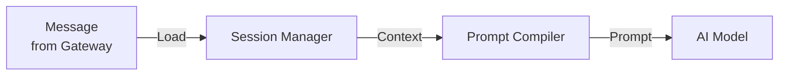
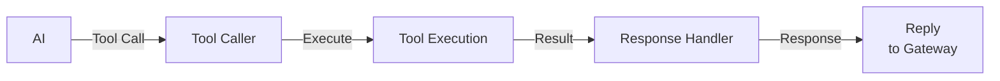
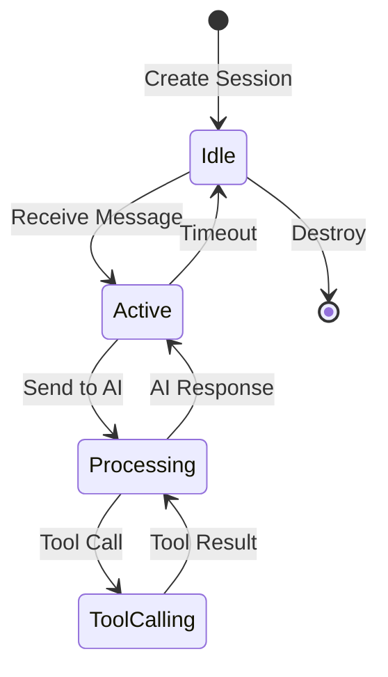
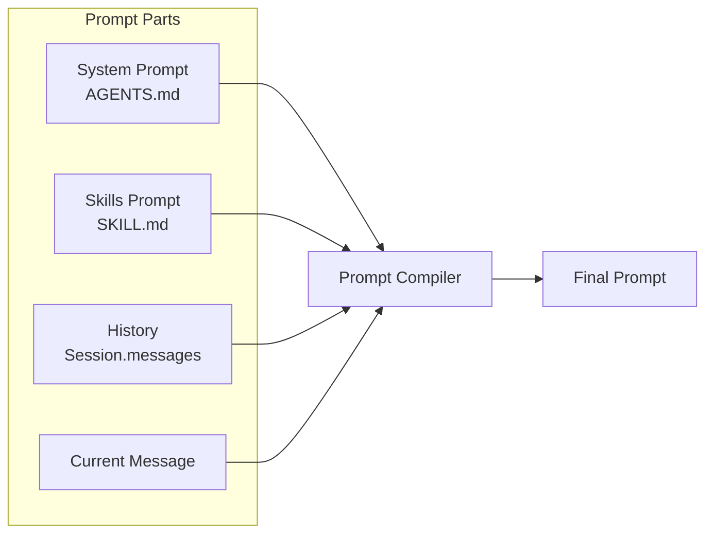
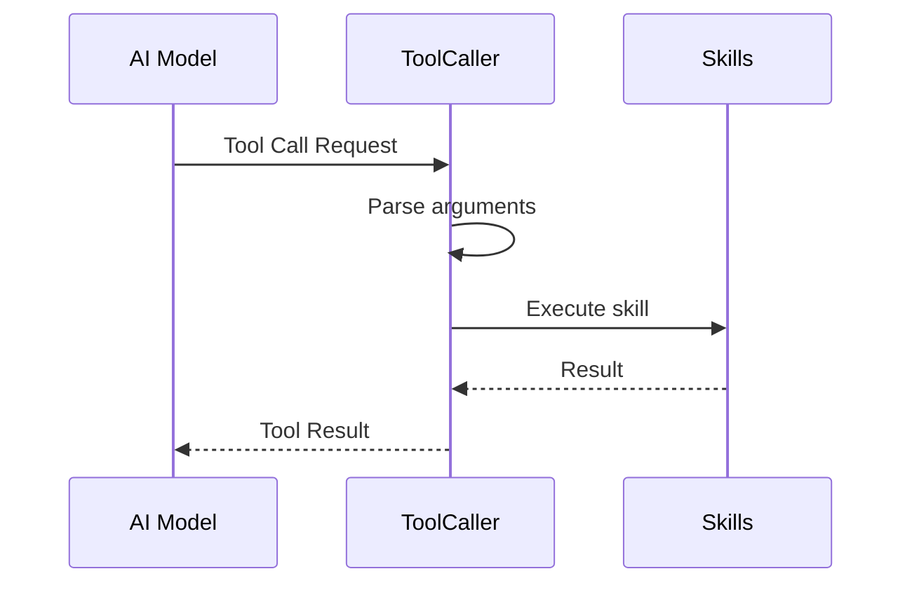
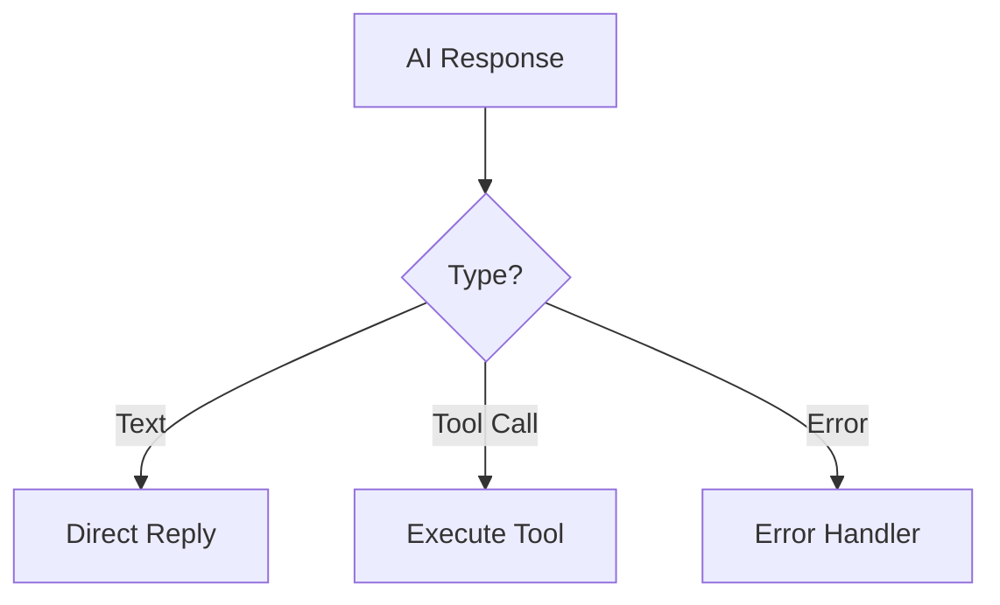
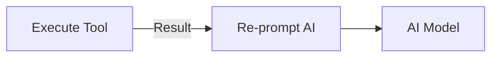
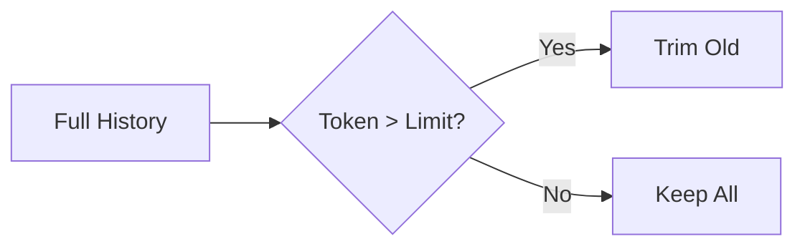

# OpenClaw 架构拆解 - L2-2 Agent Runtime

> **前置阅读**：[L1 主脉络](./openclaw-L1-主脉络.md) → [L2-1 Gateway & Channels](./openclaw-L2-1-Gateway-Channels.md)

---

## 一句话总结

**Agent Runtime 是 AI 对话引擎**，负责：加载用户会话 → 组装 Prompt（系统提示 + Skills + 历史消息）→ 调用 AI 模型 → 解析 Tool Calls → 执行工具 → 返回结果。

---

## Agent Runtime 核心流程

### 图 1：主处理流程



### 图 2：工具调用分支



---

## 核心文件

| 文件 | 行号范围 | 职责 | 关键类/函数 |
|:---|:---|:---|:---|
| `src/agents/runtime.ts` | 1-500 | Agent 运行时核心 | `AgentRuntime` |
| `src/agents/session.ts` | 1-400 | 会话状态管理 | `SessionManager`, `Session` |
| `src/agents/prompt.ts` | 1-300 | Prompt 编译 | `compilePrompt()` |
| `src/agents/tools.ts` | 1-350 | 工具调用处理 | `handleToolCall()` |
| `src/agents/response.ts` | 1-250 | 响应处理 | `processResponse()` |

---

## 会话管理（Session）

### Session 生命周期



### Session 数据结构

```typescript
// src/agents/session.ts:50-100
interface Session {
  id: string                    // 会话 ID
  channelId: string            // 渠道标识
  userId: string               // 用户标识
  messages: Message[]          // 历史消息
  skills: string[]             // 已加载 Skills
  context: Context             // 上下文数据
  createdAt: Date
  updatedAt: Date
}
```

### Session 管理器

| 方法 | 输入 | 输出 | 职责 |
|:---|:---|:---|:---|
| `getSession(id)` | sessionId | Session | 获取或创建会话 |
| `saveMessage()` | Message | void | 保存消息到历史 |
| `getContext()` | - | Context | 获取会话上下文 |
| `clear()` | - | void | 清空会话 |

---

## Prompt 编译流程

### 图 3：Prompt 组成部分



### Prompt 组成（按顺序）

| 部分 | 来源 | 内容 |
|:---|:---|:---|
| 1. System | `AGENTS.md` + `SOUL.md` | AI 角色定义、项目规范 |
| 2. Skills | `skills/*/SKILL.md` | 可用能力说明 |
| 3. Tools | Skill 元数据 | 工具 Schema（OpenAI function calling 格式）|
| 4. History | Session | 最近 N 条对话历史 |
| 5. Current | Gateway | 当前用户消息 |

### Prompt 编译代码

```typescript
// src/agents/prompt.ts:20-80
export function compilePrompt(
  session: Session,
  skills: Skill[],
  systemPrompt: string
): string {
  const parts = [
    systemPrompt,           // AGENTS.md 内容
    formatSkills(skills),   // Skills 说明
    formatTools(skills),    // 工具 Schema
    formatHistory(session), // 历史消息
    formatCurrent(session)  // 当前消息
  ]
  return parts.join('\n\n')
}
```

---

## 工具调用（Tool Calling）

### 图 4：单次工具调用



### Tool Schema 格式（OpenAI Function Calling）

```typescript
// src/agents/tools.ts:30-70
interface ToolSchema {
  type: 'function'
  function: {
    name: string
    description: string
    parameters: {
      type: 'object'
      properties: Record<string, any>
      required: string[]
    }
  }
}

// 从 Skill 生成
function skillToToolSchema(skill: Skill): ToolSchema {
  return {
    type: 'function',
    function: {
      name: skill.name,
      description: skill.description,
      parameters: skill.parameters
    }
  }
}
```

---

## 响应处理

### 图 5：响应类型判断



### 图 6：工具调用后循环



### 响应处理器

| 方法 | 输入 | 输出 | 职责 |
|:---|:---|:---|:---|
| `isToolCall()` | Response | boolean | 判断是否工具调用 |
| `extractToolCalls()` | Response | ToolCall[] | 提取工具调用列表 |
| `formatToolResult()` | Result | string | 格式化工具结果 |
| `streamResponse()` | Stream | void | 流式响应处理 |

---

## 上下文窗口管理

### 图 7：消息截断策略



### 截断规则

| 场景 | 策略 |
|:---|:---|
| Token 超限 | 保留 System Prompt + 最近 N 条消息 |
| 超长单条 | 截断到最大长度 |
| 工具结果 | 优先保留，帮助上下文理解 |

---

## 关键设计模式

| 模式 | 应用 | 好处 |
|:---|:---|:---|
| **State Machine** | Session 生命周期 | 清晰管理会话状态 |
| **Builder** | Prompt 编译 | 灵活组装 Prompt 各部分 |
| **Strategy** | 响应处理 | 根据类型选择处理策略 |
| **Observer** | 流式响应 | 实时推送消息到客户端 |

---

## 你能改什么

| 场景 | 文件 | 行号 | 修改点 |
|:---|:---|:---|:---|
| **修改 Prompt 模板** | `src/agents/prompt.ts` | 20-80 | `compilePrompt()` |
| **调整上下文长度** | `src/agents/session.ts` | 150-200 | 消息截断逻辑 |
| **自定义工具格式** | `src/agents/tools.ts` | 30-70 | `skillToToolSchema()` |
| **添加响应处理** | `src/agents/response.ts` | 50-150 | 新响应类型 |
| **修改会话超时** | `src/agents/session.ts` | 200-250 | TTL 配置 |

---

## 文件清单

```
src/agents/
├── runtime.ts          # Agent 运行时核心
├── session.ts          # 会话管理
├── prompt.ts           # Prompt 编译
├── tools.ts            # 工具调用处理
├── response.ts         # 响应处理
└── skills/
    ├── loader.ts       # Skill 加载器
    ├── registry.ts     # Skill 注册表
    ├── status.ts       # Skill 状态检查
    └── install.ts      # Skill 安装
```

---

*L2-2 Agent Runtime 完成。下一步：L2-3 Skills System。*
