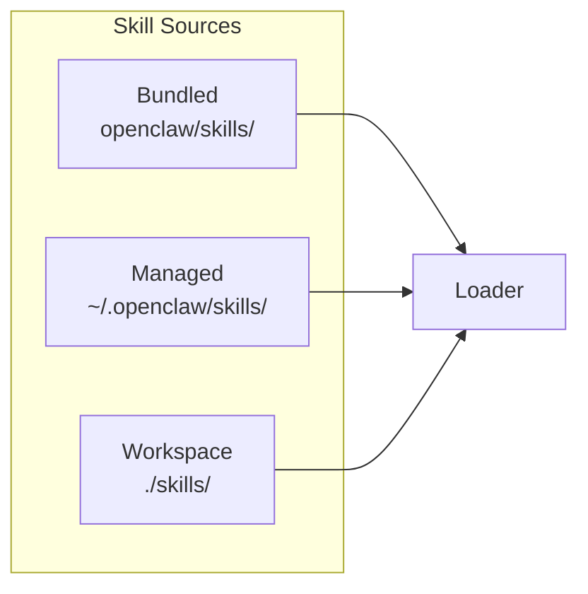
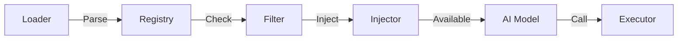
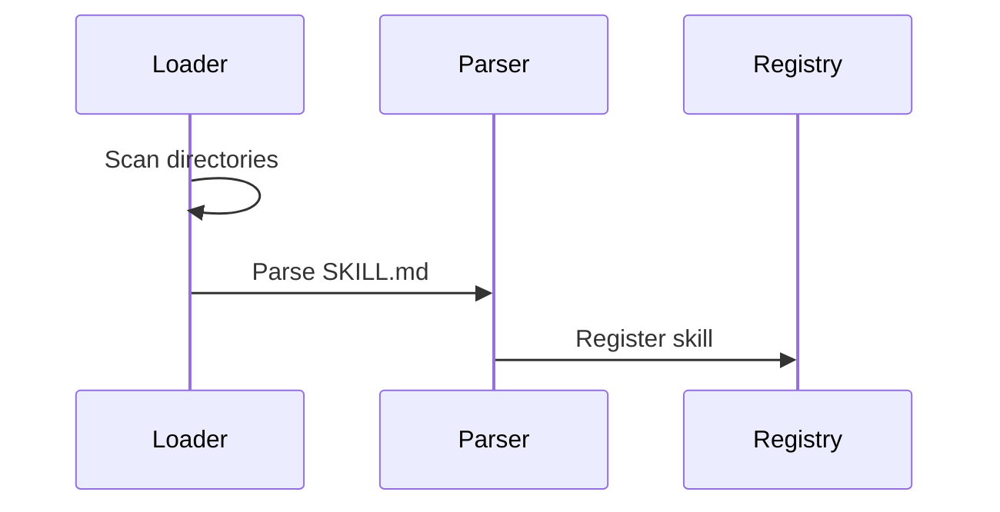
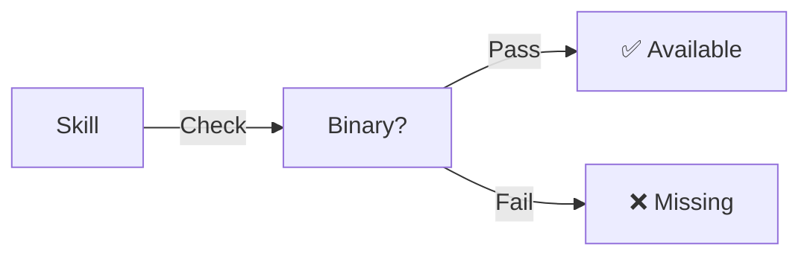
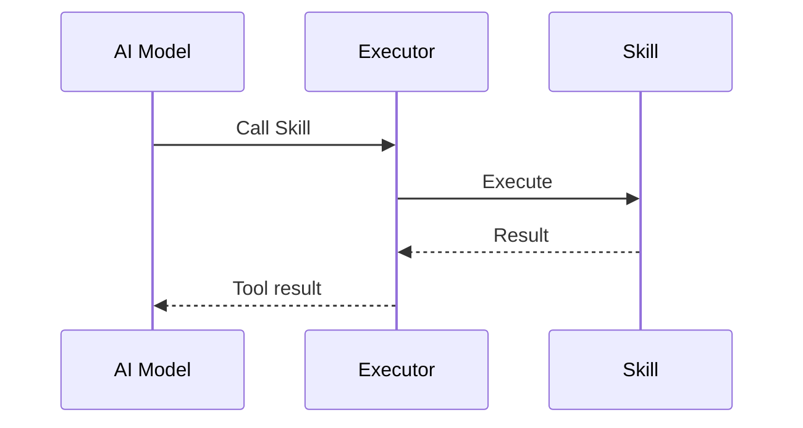
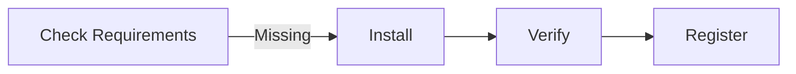
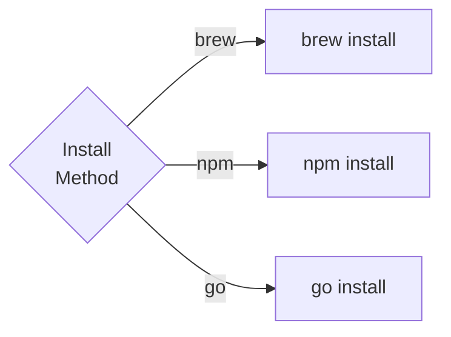
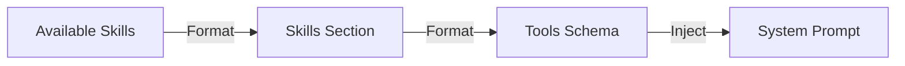

# OpenClaw 架构拆解 - L2-3 Skills System

> **前置阅读**：[L1 主脉络](./openclaw-L1-主脉络.md) → [L2-1 Gateway & Channels](./openclaw-L2-1-Gateway-Channels.md) → [L2-2 Agent Runtime](./openclaw-L2-2-Agent-Runtime.md)

---

## 一句话总结

**Skills System 是声明式能力扩展框架**：SKILL.md 文件定义能力 → Loader 加载 → Registry 注册 → Filter 按环境过滤 → 注入到 AI Prompt。

---

## Skills System 架构

### 图 1：Skill 来源层



### 图 2：处理与运行时层



---

## 核心文件

| 文件 | 行号范围 | 职责 | 关键函数 |
|:---|:---|:---|:---|
| `src/agents/skills/loader.ts` | 1-400 | 从磁盘加载 Skills | `loadSkills()` |
| `src/agents/skills/registry.ts` | 1-250 | Skill 注册表 | `register()`, `get()` |
| `src/agents/skills/status.ts` | 1-300 | 环境兼容性检查 | `checkStatus()` |
| `src/agents/skills/install.ts` | 1-350 | Skill 安装/卸载 | `installSkill()` |
| `src/agents/skills/executor.ts` | 1-400 | Skill 执行器 | `execute()` |

---

## Skill 加载流程

### 图 3：加载简化流程



### 加载优先级

```
1. Bundled    (openclaw/skills/)     - 内置 Skills
2. Managed    (~/.openclaw/skills/)  - 用户级 Skills
3. Workspace  (./skills/)            - 项目级 Skills
4. Plugins    (extensions/)          - 插件 Skills
```

---

## SKILL.md 文件格式

### 文件结构

```yaml
---
# YAML Frontmatter
name: github                          # Skill 名称
description: GitHub operations        # 描述
homepage: https://...                 # 主页（可选）
metadata:
  openclaw:
    # 安装配置
    install:
      brew: ["gh"]                    # Homebrew 依赖
      npm: ["@octokit/rest"]          # npm 依赖
      go: ["github.com/cli/cli"]      # Go 依赖
    
    # 环境要求
    requires:
      bins: ["gh"]                    # 需要二进制
      env: ["GITHUB_TOKEN"]           # 需要环境变量
      config: ["github.token"]        # 需要配置
      os: ["macos", "linux"]          # 支持系统
    
    # API Key 映射
    primaryEnv: GITHUB_TOKEN
---

# Markdown Body

## Overview
Skill 概述...

## Quick Start
快速开始...

## Workflow
使用流程...

## Guardrails
- MUST: 必须做的
- NEVER: 禁止做的

## Examples
示例...
```

### 内置 Skills（选列）

| Skill | 用途 | 依赖 |
|:---|:---|:---|
| **github** | GitHub 操作 | `gh` CLI |
| **slack** | Slack 消息 | Bot Token |
| **notion** | Notion 页面 | API Key |
| **1password** | 密码管理 | `op` CLI |
| **oracle** | 深度分析模式 | - |
| **summarize** | 文本摘要 | - |
| **weather** | 天气查询 | API Key |
| **spotify-player** | Spotify 控制 | OAuth |

---

## Skill Registry

### 注册表结构

```typescript
// src/agents/skills/registry.ts:30-80
class SkillRegistry {
  private skills = new Map<string, Skill>()

  register(skill: Skill) {
    this.skills.set(skill.name, skill)
  }

  get(name: string): Skill | undefined {
    return this.skills.get(name)
  }

  list(): Skill[] {
    return Array.from(this.skills.values())
  }

  filter(predicate: (s: Skill) => boolean): Skill[] {
    return this.list().filter(predicate)
  }
}
```

### 状态检查



---

## Skill 执行流程

### 图 4：执行流程



### 执行器实现

```typescript
// src/agents/skills/executor.ts:50-120
export async function executeSkill(
  skill: Skill,
  args: Record<string, any>,
  context: ExecutionContext
): Promise<SkillResult> {
  // 1. 验证输入
  validateArgs(skill, args)

  // 2. 准备环境
  const env = prepareEnvironment(skill, context)

  // 3. 执行命令
  const result = await runCommand(skill.command, args, env)

  // 4. 格式化输出
  return formatResult(result)
}
```

---

## Skill 安装系统

### 图 5：安装流程概览



### 图 6：安装方式选择



### 安装配置示例

```yaml
# metadata.openclaw.install
install:
  brew:
    - gh                    # 简单包
    - name: mytool
      tap: owner/repo      # 带 tap
  
  npm:
    - @octokit/rest
    
  go:
    - github.com/cli/cli@latest
    
  uv:
    - package: mytool
      python: ">=3.10"
  
  download:
    - url: https://example.com/tool
      binary: tool
      checksum: sha256:abc...
```

---

## 注入到 Prompt

### 图 7：注入流程



### Prompt 中的 Skills 格式

```markdown
## Available Skills

You have access to the following skills:

### github
Operate GitHub via the gh CLI.

**Tools:**
- github.create_issue(repo, title, body)
- github.create_pr(repo, title, branch, base)
- github.list_repos()

**Guardrails:**
- MUST: Use `gh pr view` before commenting
- NEVER: Edit workflow files directly

### slack
Send messages to Slack channels.

**Tools:**
- slack.send_message(channel, text)
- slack.list_channels()
```

---

## 关键设计模式

| 模式 | 应用 | 好处 |
|:---|:---|:---|
| **Plugin** | Skill 来源扩展 | 支持多种来源 |
| **Registry** | Skill 管理 | 统一注册/查询 |
| **Strategy** | 安装方式 | 支持多种安装器 |
| **Chain of Responsibility** | 环境检查 | 逐步验证可用性 |

---

## 你能改什么

| 场景 | 文件 | 行号 | 修改点 |
|:---|:---|:---|:---|
| **新增 Skill** | `skills/{name}/SKILL.md` | - | 创建 SKILL.md |
| **修改 Skill 加载** | `src/agents/skills/loader.ts` | 50-150 | 加载逻辑 |
| **自定义安装器** | `src/agents/skills/install.ts` | 100-200 | 安装方法 |
| **修改注入格式** | `src/agents/skills/system-prompt.ts` | 20-80 | Prompt 格式 |
| **添加状态检查** | `src/agents/skills/status.ts` | 80-150 | 检查逻辑 |

---

## 文件清单

```
src/agents/skills/
├── loader.ts           # Skill 加载器
├── registry.ts         # Skill 注册表
├── status.ts           # 状态检查
├── install.ts          # 安装系统
├── executor.ts         # 执行器
└── system-prompt.ts    # Prompt 注入

skills/                 # 内置 Skills（50+ 个）
├── github/
│   └── SKILL.md
├── slack/
│   └── SKILL.md
├── notion/
│   └── SKILL.md
├── 1password/
│   └── SKILL.md
├── oracle/
│   └── SKILL.md
└── ... (45+ more)

~/.openclaw/skills/     # 用户级 Skills
./skills/               # 项目级 Skills
```

---

*L2-3 Skills System 完成。下一步：L2-4 Providers。*
