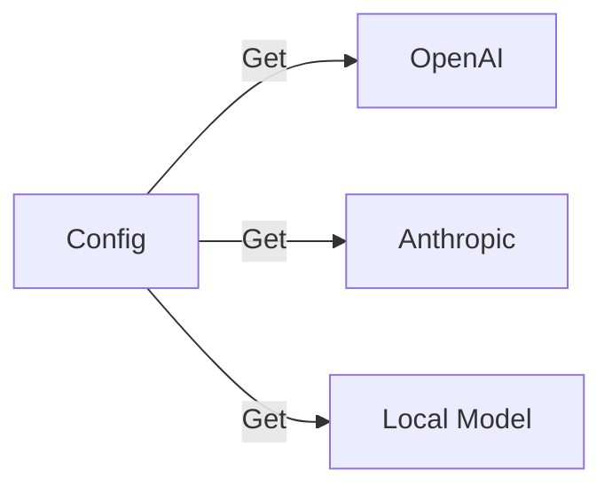
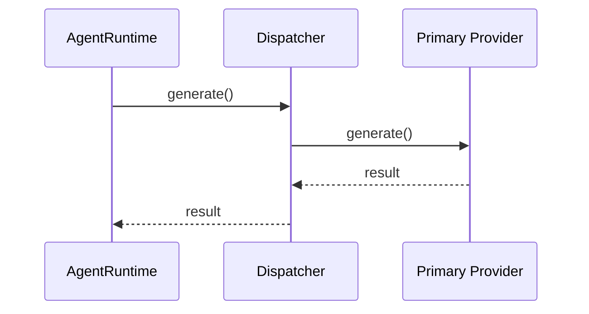
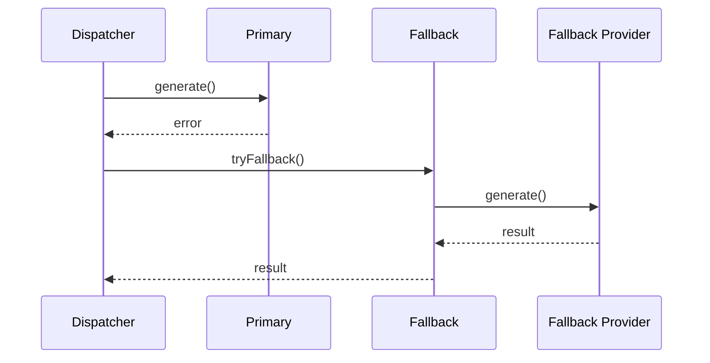
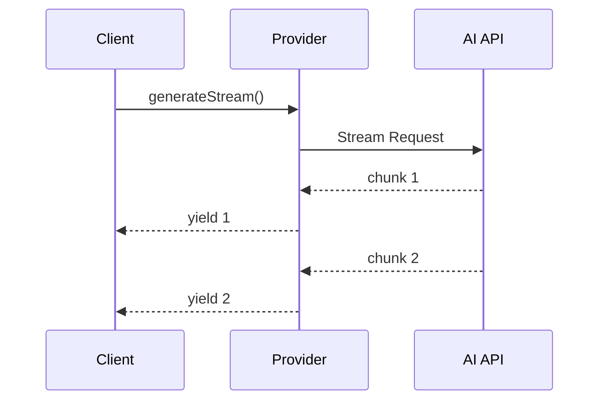

# OpenClaw 架构拆解 - L2-4 Providers

> **前置阅读**：[L1 主脉络](./openclaw-L1-主脉络.md) → [L2-1 Gateway & Channels](./openclaw-L2-1-Gateway-Channels.md) → [L2-2 Agent Runtime](./openclaw-L2-2-Agent-Runtime.md) → [L2-3 Skills System](./openclaw-L2-3-Skills-System.md)

---

## 一句话总结

**Providers 是 AI 模型调度层**：统一接口封装 OpenAI/Anthropic/本地模型 → 支持多模型 Fallback → 处理流式响应 → 透明切换不同 provider。

---

## Providers 架构

### 图 1：调度层


### 图 2：Provider 实现层



### 图 3：Fallback 机制


---

## 核心文件

| 文件 | 行号范围 | 职责 | 关键函数 |
|:---|:---|:---|:---|
| `src/providers/dispatcher.ts` | 1-300 | 请求分发 | `dispatch()` |
| `src/providers/provider-config.ts` | 1-250 | Provider 配置 | `getConfig()` |
| `src/providers/fallback.ts` | 1-200 | Fallback 逻辑 | `tryFallback()` |
| `src/providers/openai.ts` | 1-400 | OpenAI 实现 | `generate()` |
| `src/providers/anthropic.ts` | 1-350 | Anthropic 实现 | `generate()` |
| `src/providers/local.ts` | 1-300 | 本地模型 | `generate()` |

---

## Provider 接口

### 统一接口定义

```typescript
// src/providers/types.ts:20-60
interface Provider {
  name: string
  
  // 生成响应（非流式）
  generate(
    prompt: string,
    tools: Tool[],
    options: GenerateOptions
  ): Promise<GenerateResult>
  
  // 生成响应（流式）
  generateStream(
    prompt: string,
    tools: Tool[],
    options: GenerateOptions
  ): AsyncIterable<StreamChunk>
  
  // 检查可用性
  checkAvailability(): Promise<boolean>
}

interface GenerateResult {
  content: string
  toolCalls?: ToolCall[]
  usage?: TokenUsage
}
```

---

## Dispatcher 工作流程

### 图 4：正常流程



### 图 5：Fallback 流程



### Dispatcher 实现

```typescript
// src/providers/dispatcher.ts:50-120
export async function dispatch(
  prompt: string,
  tools: Tool[],
  options: DispatchOptions
): Promise<GenerateResult> {
  const primary = getPrimaryProvider()
  
  try {
    return await primary.generate(prompt, tools, options)
  } catch (error) {
    // Primary failed, try fallback
    return tryFallback(prompt, tools, options, error)
  }
}
```

---

## Provider 配置

### 配置结构

```typescript
// src/providers/provider-config.ts:30-80
interface ProviderConfig {
  primary: string              // 主 provider
  fallback: string[]           // fallback 链
  models: Record<string, ModelConfig>
}

interface ModelConfig {
  provider: string
  model: string
  temperature?: number
  maxTokens?: number
  apiKey?: string
  baseUrl?: string
}
```

### 配置示例

```json
{
  "primary": "openai",
  "fallback": ["anthropic", "local"],
  "models": {
    "gpt-4": {
      "provider": "openai",
      "model": "gpt-4",
      "temperature": 0.7
    },
    "claude-3": {
      "provider": "anthropic",
      "model": "claude-3-opus-20240229"
    },
    "local-llama": {
      "provider": "local",
      "model": "llama3.1",
      "baseUrl": "http://localhost:11434"
    }
  }
}
```

---

## Fallback 策略

### 图 6：Fallback 链


### Fallback 条件

| 条件 | 行为 |
|:---|:---|
| API 错误（5xx） | 立即 fallback |
| Rate Limit | 等待后重试，然后 fallback |
| Timeout | 直接 fallback |
| 内容过滤 | 尝试其他 provider |

### Fallback 实现

```typescript
// src/providers/fallback.ts:40-100
export async function tryFallback(
  prompt: string,
  tools: Tool[],
  options: DispatchOptions,
  lastError: Error
): Promise<GenerateResult> {
  const fallbackChain = getFallbackChain()
  
  for (const providerName of fallbackChain) {
    try {
      const provider = getProvider(providerName)
      return await provider.generate(prompt, tools, options)
    } catch (error) {
      // Log and continue to next fallback
      logger.warn(`${providerName} failed:`, error)
    }
  }
  
  // All fallbacks exhausted
  throw new AllProvidersFailedError(lastError)
}
```

---

## Provider 实现对比

| Provider | 库/SDK | 流式支持 | 工具调用 | 特点 |
|:---|:---|:---|:---|:---|
| **OpenAI** | openai | ✅ | ✅ | 功能最全 |
| **Anthropic** | @anthropic-ai/sdk | ✅ | ✅ | Claude 系列 |
| **Local** | ollama / llama.cpp | ✅ | ⚠️ | 本地运行，隐私优先 |
| **OpenRouter** | 通用 HTTP | ✅ | ✅ | 统一接口访问多模型 |

---

## OpenAI Provider 实现

### 图 7：请求处理流程


### 代码实现

```typescript
// src/providers/openai.ts:60-150
export class OpenAIProvider implements Provider {
  private client: OpenAI

  async generate(
    prompt: string,
    tools: Tool[],
    options: GenerateOptions
  ): Promise<GenerateResult> {
    const response = await this.client.chat.completions.create({
      model: options.model || 'gpt-4',
      messages: [
        { role: 'system', content: prompt }
      ],
      tools: this.formatTools(tools),
      temperature: options.temperature,
      max_tokens: options.maxTokens
    })

    return {
      content: response.choices[0].message.content || '',
      toolCalls: this.parseToolCalls(response.choices[0].message.tool_calls),
      usage: response.usage
    }
  }

  // 流式实现...
}
```

---

## 流式响应处理

### 图 8：流式传输



---

## 关键设计模式

| 模式 | 应用 | 好处 |
|:---|:---|:---|
| **Strategy** | Provider 实现 | 统一接口，不同实现 |
| **Chain of Responsibility** | Fallback | 链式尝试多个 provider |
| **Adapter** | 响应格式转换 | 统一不同 provider 的输出 |
| **Factory** | Provider 创建 | 根据配置创建实例 |

---

## 你能改什么

| 场景 | 文件 | 行号 | 修改点 |
|:---|:---|:---|:---|
| **新增 Provider** | `src/providers/{name}.ts` | - | 实现 Provider 接口 |
| | `src/providers/dispatcher.ts` | 30-60 | 注册新 provider |
| **修改 Fallback 链** | `src/providers/fallback.ts` | 20-50 | fallback 逻辑 |
| **自定义模型配置** | `~/.openclaw/config.json` | - | provider 配置 |
| **调整超时时间** | `src/providers/dispatcher.ts` | 60-90 | timeout 配置 |
| **添加重试逻辑** | `src/providers/dispatcher.ts` | 50-100 | retry 策略 |

---

## 文件清单

```
src/providers/
├── types.ts              # Provider 接口定义
├── dispatcher.ts         # 请求分发器
├── provider-config.ts    # Provider 配置
├── fallback.ts           # Fallback 逻辑
├── openai.ts             # OpenAI 实现
├── anthropic.ts          # Anthropic 实现
├── local.ts              # 本地模型实现
├── openrouter.ts         # OpenRouter 实现
└── utils.ts              # 工具函数
```

---

*L2-4 Providers 完成。下一步：L3 细节实现。*
